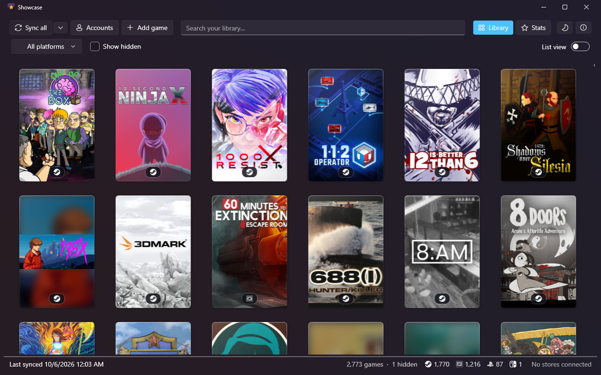
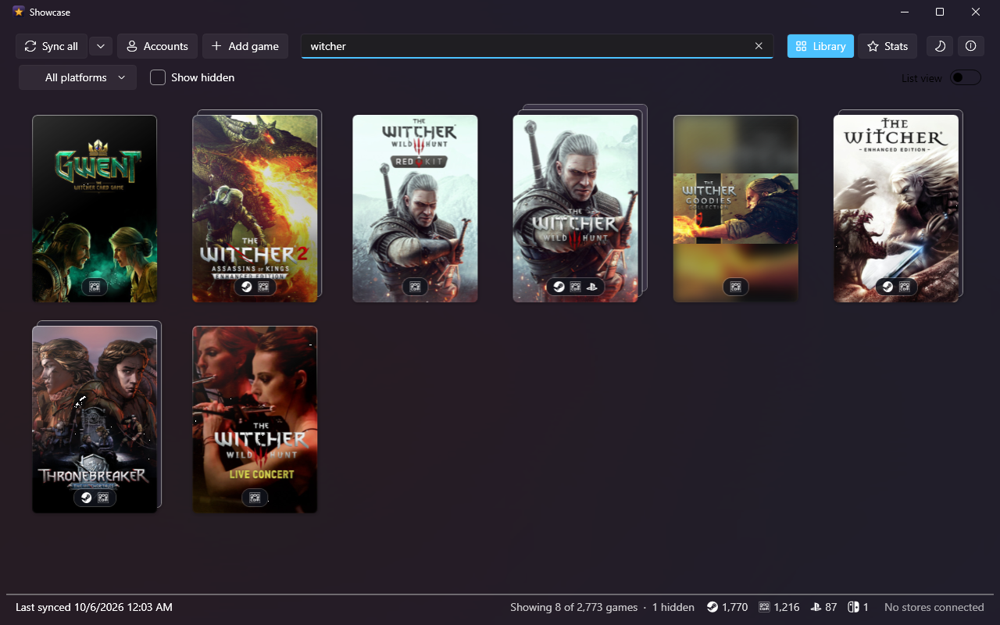
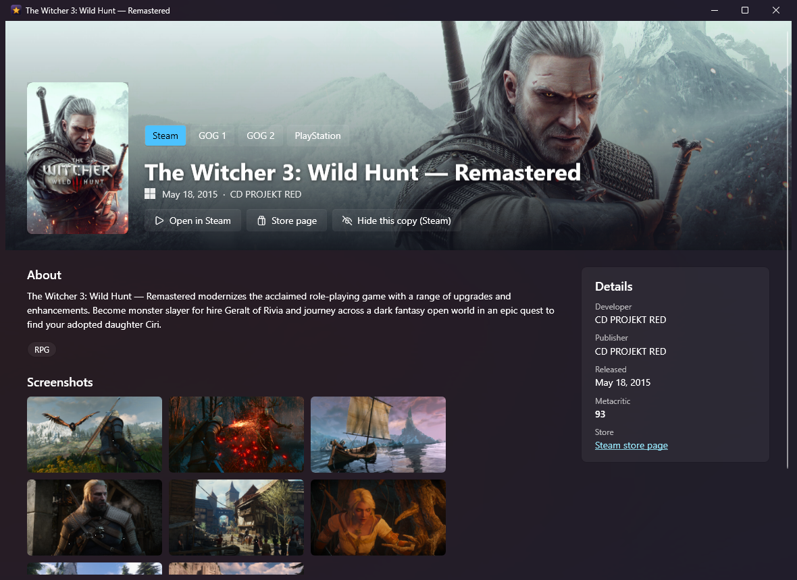
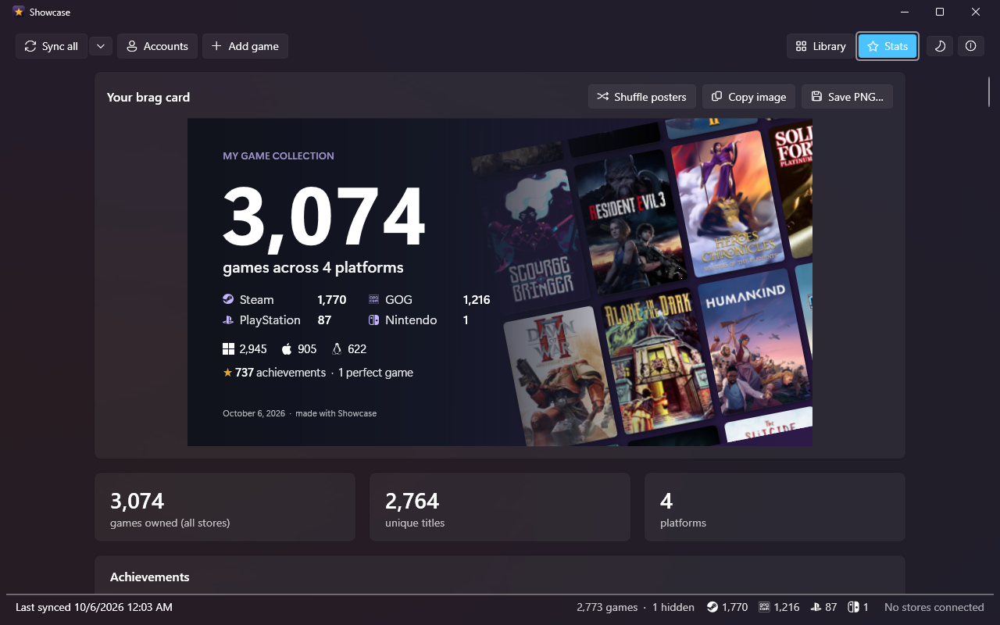
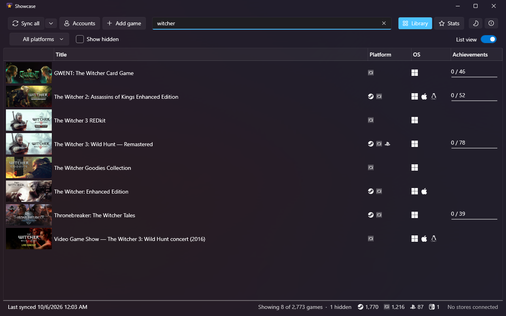
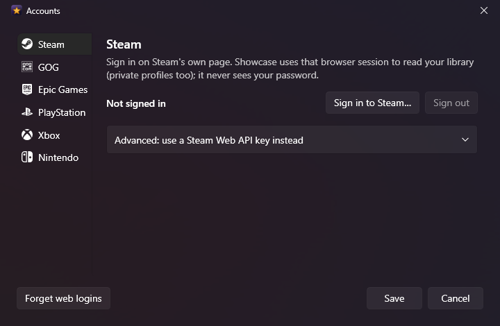

# Showcase

All the games you own, from every store, in one place: to search, and to brag.
Steam, GOG, Epic Games, PlayStation, Xbox and Nintendo, plus the cartridges and discs on your shelf.

**[gaming.wizhut.tech/showcase](https://gaming.wizhut.tech/showcase)** has the full tour.

## Download

**[Showcase 1.1.0 for Windows (64-bit)](https://github.com/wizhut/showcase-releases/raw/main/Showcase-1.1.0-x64.msi)** (50 MB)

Run the installer: Showcase goes to Program Files with a Start menu shortcut, and .NET is included.
It needs Windows 10 or 11 (64-bit) and the Microsoft Edge WebView2 runtime, which Windows 11 already has.
The installer isn't code-signed yet, so Windows SmartScreen may warn before it runs: choose
*More info*, then *Run anyway*.

Once installed, Showcase keeps itself up to date: when a new version is out, it offers to install it.

## Screenshots

**A game you own three times is one poster.** Copies from different stores stack, with an icon for each store; search covers them all.

**Every game gets its own page.** Banner, description, release date, developer, screenshots, and the achievements you've unlocked with how rare each one is.

**Numbers worth showing off.** Games, unique titles, the split by store and by operating system, achievements and perfect games, plus a brag card to save as a PNG.

**Or as a list.** Banner, stores, operating systems and achievement progress, sortable on any of them.

**You sign in on each store's own page.** Showcase never sees your password, and the sign-ins stay encrypted on your PC.

More on [gaming.wizhut.tech/showcase](https://gaming.wizhut.tech/showcase).

## What's new

See the [changelog](CHANGELOG.md).

---

Free to use, just for games. Made by [gaming.wizhut.tech](https://gaming.wizhut.tech).
© 2026 gaming.wizhut.tech. All rights reserved. This repository only hosts the
installers; Showcase's source code isn't published. Showcase isn't affiliated with or endorsed by Valve,
GOG, Epic Games, Sony, Microsoft or Nintendo.
